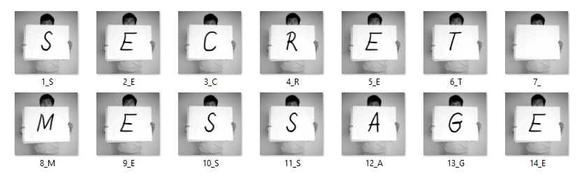

# 📄 Message Image Creator 🖼️

Welcome to the **Message Image Creator**! This project allows you to create a sequence of images representing letters in a message using pre-defined image files for each letter (A-Z), period (.), and space. It's a simple but creative way to generate a visual representation of any text message.


---

## ✨ Features

- Convert any text message (A-Z, periods, and spaces) into images.
- Automatically map each character to its corresponding image.
- Output images are named and numbered sequentially for easy identification.
- Handles spaces and punctuation smoothly.
- Clears previous message images for clean output.

---

## 🚀 How It Works

1. **Input**: Enter a message using characters A-Z, period (.), and spaces.
2. **Image Mapping**: Each character is mapped to a pre-stored image file in the `Alphabet` folder.
3. **Output**: The images are copied to a new `MESSAGE` folder with sequential numbering.

---

## 📂 Project Structure

- **Alphabet Folder**: Contains images for each character (A-Z), period, and space.
- **MESSAGE Folder**: Automatically created to store the output images.

---

## 🛠️ Installation & Setup

1. Clone this repository:
   ```bash
   git clone https://github.com/EsraaMamdouh1/message-image-creator.git
   cd message-image-creator
  ```
2. Ensure you have the required image files in the Alphabet folder. The files should be named as 1.jpg for 'A', 2.jpg for 'B', and so on.

## 🖥️ Usage

1. Run the script:
   ```bash
   python MESSAGE.py 
  ```
2. Enter a message when prompted, using characters **A-Z**, period (**.**), and spaces.

3. The images corresponding to your message will be saved in the `MESSAGE` folder, named in order (e.g., `1_H.jpg`, `2_I.jpg`, etc.).

## 🤖 Error Handling

- **Invalid characters**: If you enter a character outside **A-Z**, period (**.**), or space, the program will raise a `ValueError`.  
  **Example**:  
  ```plaintext
  Character 'h' is not allowed. Use only A-Z, '.', and space.

- **Missing image files**: If an image for a character is missing, a `FileNotFoundError` will be raised, indicating which image is not found.

## 👩‍💻 Contributing

We welcome contributions! Feel free to open an issue or submit a pull request for improvements or new features.
